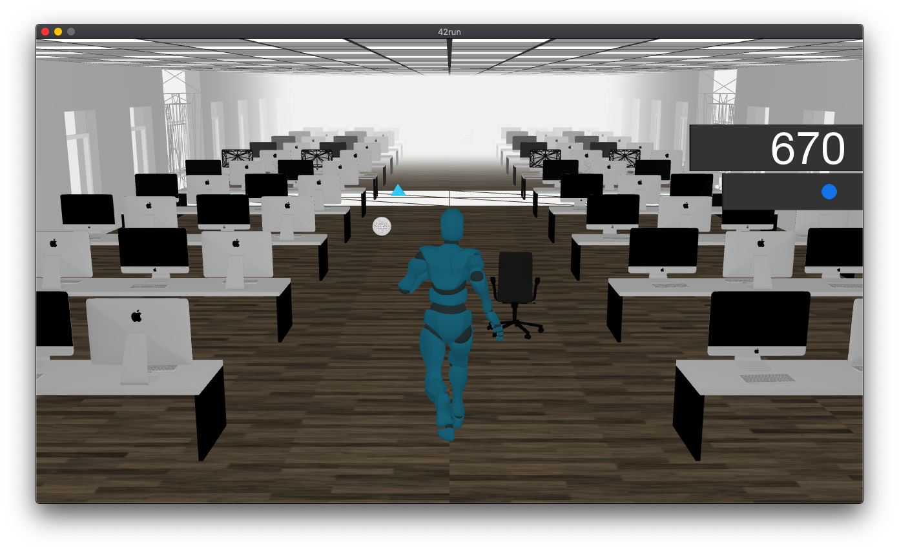

# 42run



Temple run clone made with OpenGL and C++

## Build

God bless you, if you decided to compile this project. You need these libraries :

* GLEW
* GLFW3
* FreeType2
* ASSIMP

When you get them, do this in project root :

```
mkdir build
cd build
cmake ..
make -j 4
cd ..
```

## Play

Just run executable from root :
```
./build/42run
```

## Feautres

* Pretty good set (I mean, compared to other 42runs)
* Animated character
* Obsatcles
* Bonuses

## Resources

* [OpenGL tutorial](https://habrahabr.ru/post/310790/)
* [ASSIMP tutorial](https://habr.com/en/post/338436/)
* [Animations tutorial](https://code-hub.org/tutorials/skeletal-animation-with-assimp-in-opengl/)
* [Blender modelling](https://www.youtube.com/playlist?list=PLjEaoINr3zgEq0u2MzVgAaHEBt--xLB6U)
* [Blender animation](https://www.youtube.com/playlist?list=PLn3ukorJv4vvHr6RMoXrZSMVqmOKlqbBR)
* [Free models](https://free3d.com/)
* [Free animations](https://www.mixamo.com/)
